# Roland JUNO-G LCD display replacement 

The _Roland Juno-G_ was released in 2006 and is a 61-note workstation keyboard which incorporates the sound engine from the Fantom-X, with 128-note polyphony. As the display in many cases has stopped working the keyboard's interactive features cannot be used anymore. Roland does not have/support for the keyboard and the official replacement part is out of stock. The _Roland JUNO-G LCD display replacement_ offers a solution to replace the defective LCD unit.  The first code has been originally written by GitHub user _dpeddi_ as he published it in his [LCDJunoG](https://github.com/dpeddi/LCDJunoG) repository.

This forked project improves the performance of the original code and provides how-to documentation with pictures to build your own.

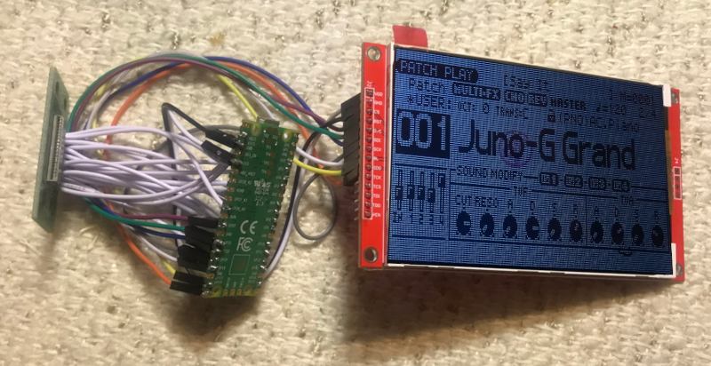

In Action: See [Video](docs/new_display_in_action.mp4)

## 1. Bill of Materials

- 1 x Raspberry Pi Pico
- 1 x LCD Display 320X480 ILI9488 4.0" module (variant without touchscreen) https://www.aliexpress.com/item/1005003033844928.html
- 17 x Wires to solder together boards (5 cm long white ones in my case: very easy to solder as they were pre-tinned https://www.aliexpress.com/item/32822880152.html)
- 9 x Jumper wires to connect headers on the display and to be soldered on the Raspberry Pi Pico like these https://www.amazon.de/-/en/gp/product/B07KFQ6483
- 1 x piece of black paper (can be printed) or black tape
- A bit of isolating tape (e.g. Kapton tape)
- Double-sided tape or liquid glue

## 2. Tools
- PC capable to run _Arduino IDE_ & _Visual Studio Code_ with a USB-A port
- Micro USB to USB-A cable (to program the Raspberry Pi Pico)
- Soldering iron & Solder
- Desoldering gun/tin extractor
- Phillips screwdriver
- Saw or cutter (to cut plastic plate and board)
- Optionally: flux pen

## 2. Software to build and install/flash the firmware on the Raspberry Pi Pico

_Note: this section can be skipped: as the software build is available under Releases_

These instructions are for Windows 10 and will be similar for other OS's supporting Arduino.

1. Install the _Arduino IDE 1.x_ to be able to install the necessary drivers on Windows https://docs.arduino.cc/software/ide-v1
2. Open Arduino IDE and open Boards Manager through main menu, open _Tools_ > _Boards ..._ > _Boards Manager._
3. Install the _Arduino Mbed OS RP2040_ package in Board Manager, by searching it and clicking _Install_. During the installation it will ask you to install drivers: confirm to install them.

      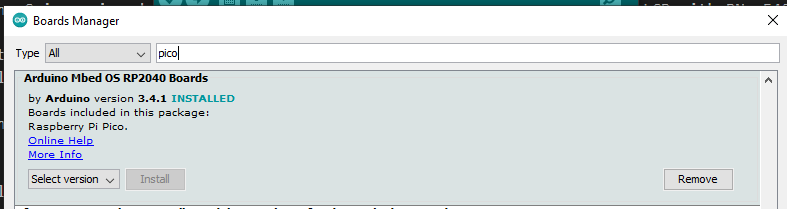

4. Close _Arduino IDE_
5. Install Visual Studio Code https://code.visualstudio.com/ and install the _PlatformIO IDE_ Extension (it will download packages needed for our build project)

      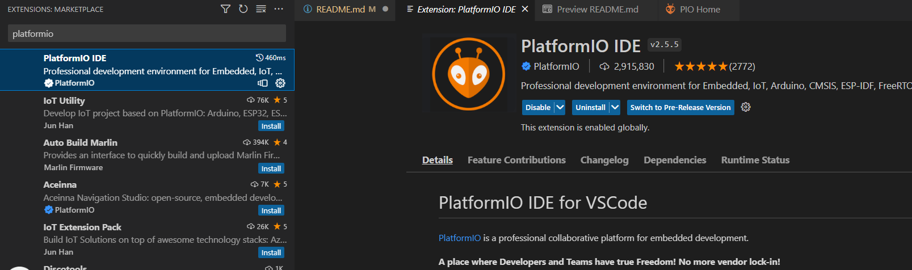

## 3. Build the firmware and flash the Raspberry Pi Pico

_Note: when you skipped the previous section, you only need to copy the .uf2 file available under Releases after step 1 on the new available drive representing the Raspberry Pi Pico to flash it_

1. Plug the USB cable in the port on the Raspberry Pi Pico and plug - while holding down the BOOTSEL button - in the PC's USB-A port. The PC should now detect the new hardware.
2. Drivers are installed for the new hardware, Windows will mount a new drive (see below) and it should show up in Device Manager, when the shown _Devices by container_ option is selected, like below:

      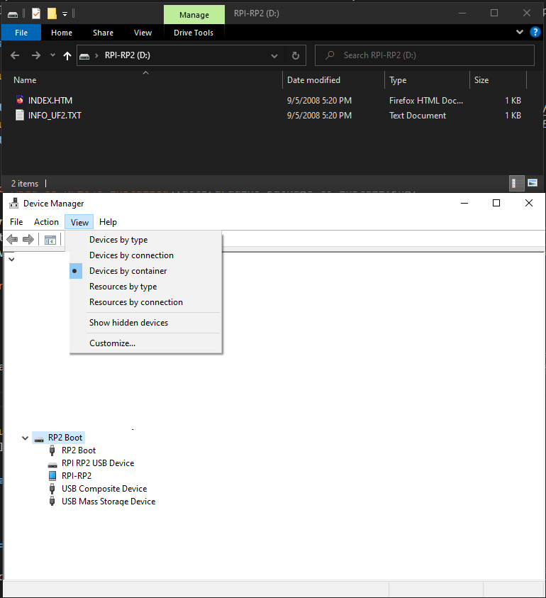

3. In _Visual Studio Code_, open the folder where have the project is located (where the downloaded ZIP-file is extracted)
4. _PlatformIO_ should now load and be selectable in the left-hand side, click on the alien-icon and then select _Build_ to build the firmware:

      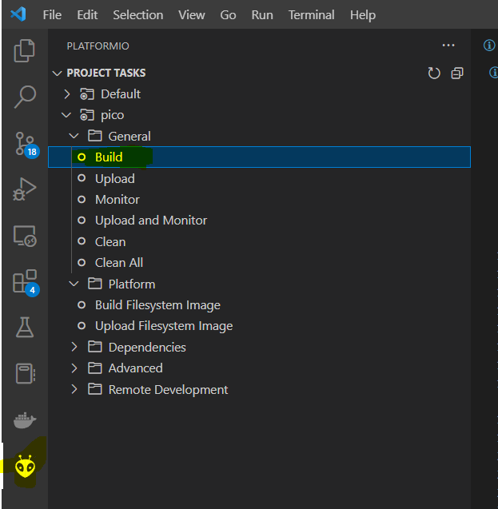

5. A TERMINAL should show the progress and end with [SUCCESS] like so:

      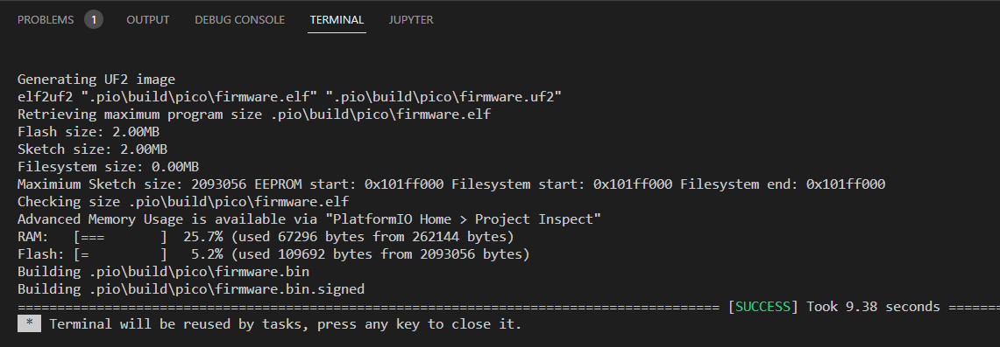

4. Select _Upload_ to upload the firmware:

      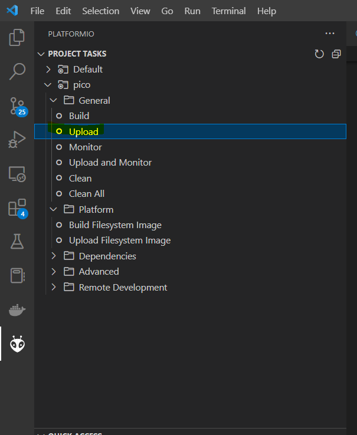
7. A TERMINAL should show the progress and end with [SUCCESS] like so:

      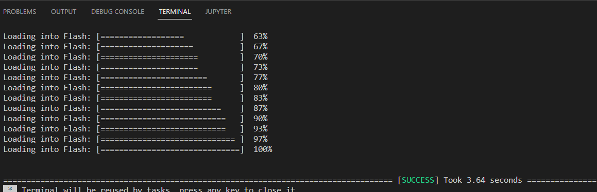

## 3. Hardware

### 3.1. Disassemble the keyboard

_Note: it is recommended to download the Service Notes and have a look at the Exploded View on pages 6 and 7 to see the different components in the keyboard_

_Note: these instructions want you to remove all circuit boards from the keyboard first to build a test rig, so that the display (flat cable) connector can be easily accessed for testing. In theory all this work is not needed if you have the new screen assembly already made. It just makes testing and ensuring it works easier, albeit more work to disassemble and reassemble all circuit boards, which comes with an increased risk of breaking other parts.  On the other hand, just removing the back cover, the JACK BOARD (the one with the MIDI ports and jacks), and some standoffs holding the middle one (PANEL-B BOARD) down to remove the middle one (which holds the display) should be sufficient to be able build and replace the display. The issue is that the middle board is connected with two flat cables (to the PANEL A & PANEL C BOARD), one on the right and one the right one and it is almost impossible to reconnect those with when these are still screwed down._

 1. Remove the back cover
 2. Unplug the gray cable connecting to the keypad
 3. Now you must remove all boards - keep the screws in seperate containers
 4. Remove the jack-board it has 4 screws in the back as well
 5. As you go and removing the remaining boards, unplug the connectors one by one, as needed. Unscrew the standoffs that have wirebusses attached - do now cut these loose
 6. Now remove the main board (the one with silver square CPU and the card reader)
 7. Remove the transparent plastic separators
 8. Remove the knobs from the front (the silver volume sliders and round pots and one encoder knob)
 9. Remove the remaining boards: PANEL-A BOARD, PANEL-B BOARD, and PANEL-C BOARD
 10. You see attached to the middle board (PANEL-B BOARD) a one small approx. 5 by 2.5 cm board. It is indicated with _JUNO G LCD BOARD ASSY JPN 733402078_ (indicated as number 23 in the Service Notes' Exploded View on page 6)
 11. You see that it's held by 4 clips that you can press in with your fingers, when you press them in you can free from the larger board
 12. Now remove the original display
 13. All boards should be removed now

### 3.2. Prepare the JUNO G LCD BOARD ASSY JPN 733402078 board
 
 Remove one of the two flat cable connectors, it will used to wire the Raspberry Pi Pico. It can very hard to do this, even with a desoldering gun as the pins of the connector are very thin andsharp. Recommended is to remove the flat cable connected indicated with CN16, so that the pin numbers below match: there is a small 18 and 1 indicated on the board. These indicate pin 18 and 1.

### 3.3. Build a test rig

_Note: in case you're not sure how the seperate boards should be connected there is a wiring diagram available in the Service Notes on page 14._

Next, you want to reassemble all the boards on a flat surface. You can place them on a bath towel for instance. Make sure all the connections have been made correctly and that boards to do touch each other and are not placed on a conducting surface:

   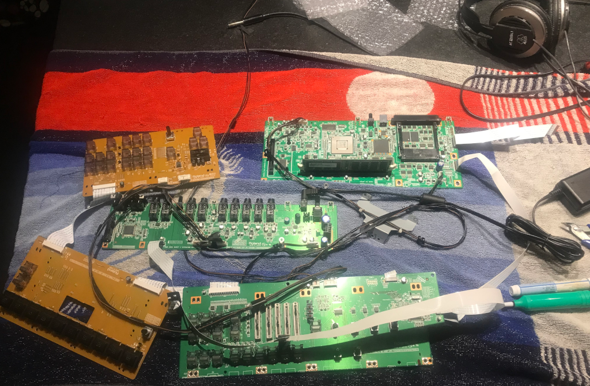

Connect the power supply and connect _JUNO G LCD BOARD ASSY JPN 733402078_ board, and apply power, and ensure that you can measure 5 V over pin 18 and pin 17, and that you can measure 3.3 V over pin 16 and 17.

### 3.4. Wire the Raspberry Pi

Remove power and disconnect the _JUNO G LCD BOARD ASSY JPN 733402078_ board.

Next wire the Raspberry Pi Pico to the _JUNO G LCD BOARD ASSY JPN 733402078_ board using the table and in this order, it makes the most sense:

|JUNO-G Pin|JUNO-G Pin Function|Raspberry Pi Pico Pin|
|---|---|---|
|18|+5V|VSYS|
|17|GND|GND (next to VSYS)|
|16|+3V|(not connected)|
|15|RST|GP14|
|14|CS1|GP13|
|13|CS2|GP12|
|12|RS|GP11|
|11|WE|GP10|
|10|D0|GP2|
|9|D1|GP3|
|8|D2|GP4|
|7|D3|GP5|
|6|D4|GP6|
|5|D5|GP7|
|4|D6|GP8|
|3|D7|GP9|
|2|BRGT|GP26|
|1|BRGT Vref|3V3|

### 3.5. Wire the LCD module

Using the jumper wires connect the LCD module to Raspberry Pi Pico.  Slide the female end on the pin header and solder the pin to the Raspberry Pi and cut off the excess. It needs to flush to the surface.

   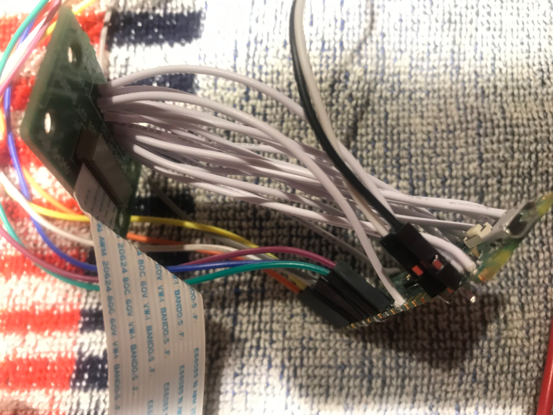

|Display Pin|Display Pin Function|Raspberry Pi Pico Pin|
|---|---|---|
|VDD|+3.3V|3V3|
|GND|GND|GND (next to 3V3)|
|CS|CS|GP22|
|RST|RST|GP21|
|Q/C|DC|GP20|
|SDI|MOSI|GP19|
|SCK|SCLK|GP18|
|BL|BL|GP17|
|SDO|MISO|GP16|
  
Connect the _JUNO G LCD BOARD ASSY JPN 733402078_ to the main board again and apply power again and ensure that the new display is working.  It will show the message _Roland JUNO-G LCD Emulator v0.5_ for a short while and it should start showing the actual display's contents.

   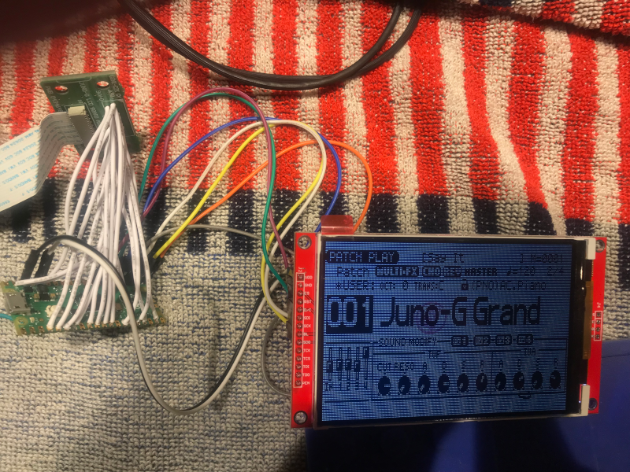

### 3.6. Strip the original display

First we need to remove the old hardware from the original display module, to then remake a new assembly for the new display

1. Remove screws and black plastic holders/standoffs:

      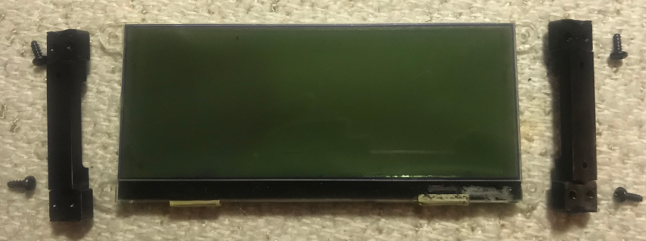

2. Remove the actual LCD, it is stuck with glue to the white/transparent plate. Use a butter knife to separate the two layers.

      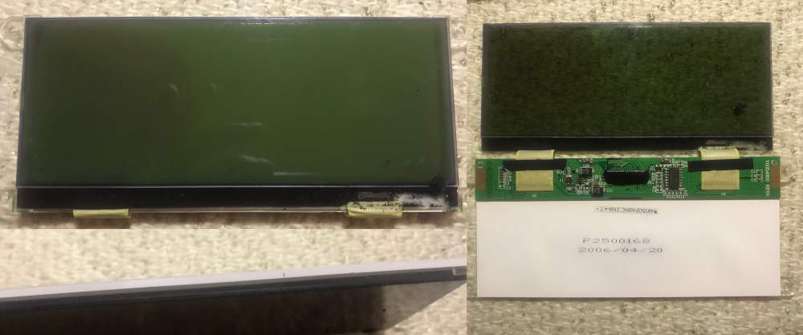

3. Flip the LCD open and turn over, now remove the board from the white/transparent plate. Use a butter knife to separate the board from the plate.

4. Now remove the white stickering & black strip to end up with a transparent plate

### 3.7. Strip the new display

The display is stuck with double-sided tape to the red board

1. At the back disconnect the flat cable from the connector (you need to slide out the black part first to open de connector)

2. Use a butter knife or flat spudger to split the display apart from the board. Be careful not to damage the flat cable, so pry free from the other side!

      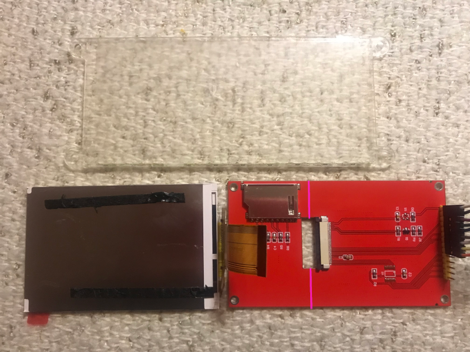

3. Remove the remaining double-sided tape from the display

4. Cut off the card reader section of the red board.  Cut the spots on both sides of the flat cable connector. A dremel was used to cut the board partly on both side and it was then broken off. See the next picture to see where.

5. Now stick the display on the middle of the transparent plate, you want the display area of the LCD to be in de middle and 1 mm below the top, where thee backgrounds LEDS are. That way the entire display area will be visible through the window.

6. Fold the flat cable over to the other side of the transparent plate

7. Now stick the red board on the other side, aligning the flat cable with double-sided tape on the other side and reconnect the flat cable.

      You end up with a unit like this now:

      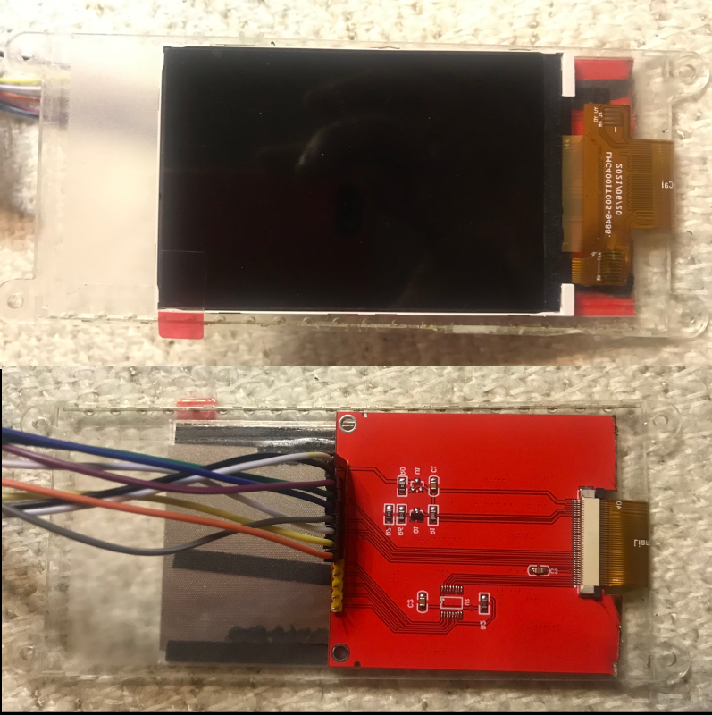

      We need to assure we have room (height of the holders/standoffs) for the new one to fit.

8. Remove the yellow plastic from the header on the board. To do so remove the jumper wires from the header, temporarly unstick the board, disconnect the flat cable, heat the plastic with lighter/heat gun and slide it to the top.

9. Place the jumper wires back, fold them over as close as possible to the board. So that they lay flat.

10. Next, cut of the unused pins of the header on the red board

11. Screw the back the plastic holders/standoffs

12. Cover the red board with some isolating tape (e.g. Kapton tape)

      You end up with a unit like this now:

      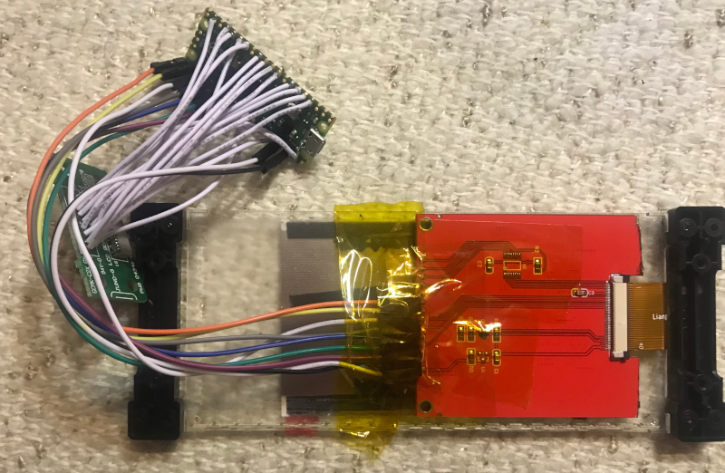

13. Screw back together the assembly back on the board and push the Raspberry Pi and _JUNO G LCD BOARD ASSY JPN 733402078_ board through the hole to make sure it ends up on the backside of the board.

      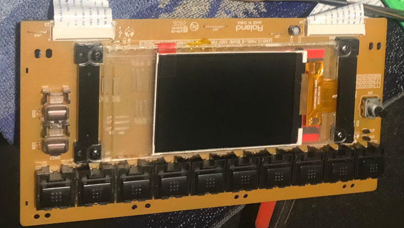

14. Place the _JUNO G LCD BOARD ASSY JPN 733402078_ board back and stick isolating tape on the Raspberry Pi Pico

      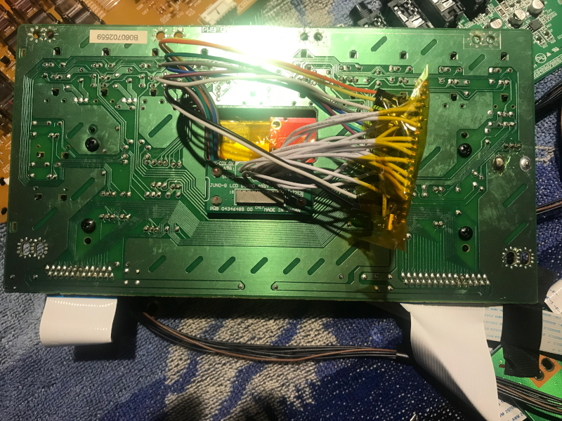

15. Remove the display protector (transparent sticker) and place black tape or cutout a piece of black paper which you stick with double-sided tape, to black-out/cover the non-display area

      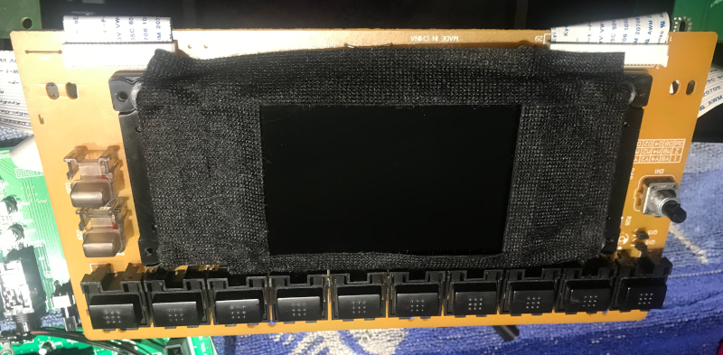

### 3.7. Reassemble the keyboard

Disconnect cables from the boards as needed and reassemble the keyboard again.

## Notes

This project uses the Programmed I/O (PIO) feature on Raspberry Pi Pico instead of "bitbanging" to read the original display protocol.

Contrary to bitbanging, PIO uses no CPU cycles. Here is an overview about PIO on the Pico https://blues.io/blog/raspberry-pi-pico-pio/. 

The original display uses two CS (Chip Select) lines, as the original screen is divided in two parts, one part gets updated through one CS line.

Service Notes extract:

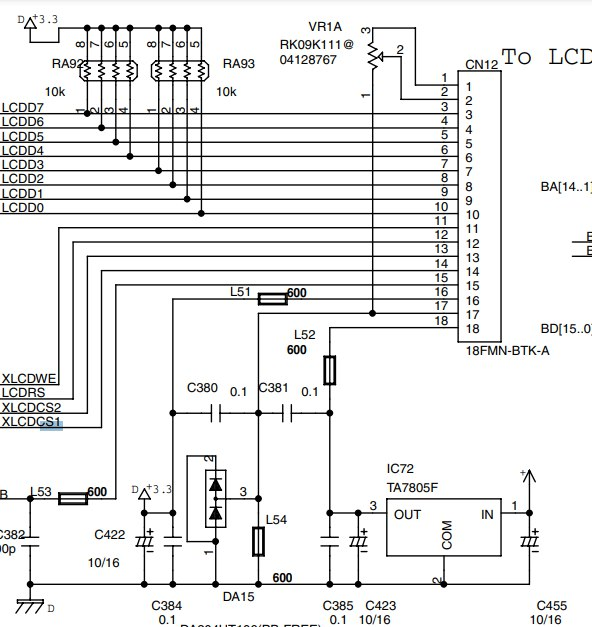

[Original read-me by GitHub user dpeddi](docs/dpeddi.md)
