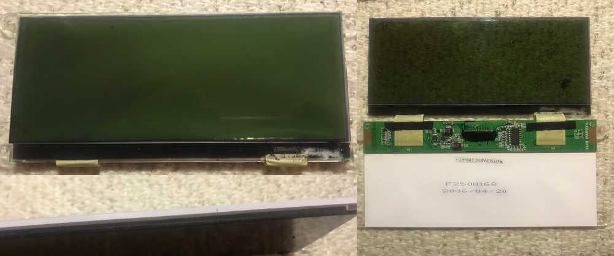

# Roland JUNO-G LCD display replacement 

The _Roland Juno-G_ was released in 2006 and is a 61-note workstation keyboard which incorporates the sound engine from the Fantom-X, with 128-note polyphony. As the display in many cases has stopped working the keyboard's interactive features cannot be used anymore. Roland does not have/support for the keyboard and the official replacement part is out of stock. The _Roland JUNO-G LCD display replacement_ offers a solution to replace the defective LCD unit.  The first code has been originally written by GitHub user _dpeddi_ as he published it in his [LCDJunoG](https://github.com/dpeddi/LCDJunoG) repository.

This branch project aims to improve the display performance and provide proper how-to documentation.

## 1. Bill of Materials

- 1 x Raspberry Pi Pico
- 1 x LCD Display ILI9488 5.0" module (variant without touchscreen) https://www.aliexpress.com/item/1005003033844928.html
- 17 x Wires to solder together boards (5 cm long white ones in my case: very easy to solder as they were pre-tinned https://nl.aliexpress.com/item/32822880152.html)
- 9 x Jumper wires to connect headers on the display and to be soldered on the Raspberry Pi Pico like these https://www.amazon.de/-/en/gp/product/B07KFQ6483
- 4 x M3 nut and bolt, to attach the new display to original display plate
- 1 x piece of black of paper (can be printed)
- Double-sided tape or liquid glue

## 2. Tools
- PC with capable to run _Aduino IDE_ & _Visual Studio Code_ with a USB-A port
- Micro USB to USB-A cable (to program the Raspberry Pi Pico)
- Soldering iron & Solde
- Desoldering gun/tin extractor
- Phillips screwdriver
- Saw and drill (to cut plastic plate and make 4 holes in plastic plate)
- Optionally: flux pen

## 2. Software to build and install/flash the firmware on the Raspberry Pi Pico

These instructions are for Windows 10 and will be similar for other OS's supporting Arduino.

1. Install the _Arduino IDE 1.x_ to be able to install the necessary drivers on Windows https://docs.arduino.cc/software/ide-v1
2. Open Arduino IDE and open Boards Manager through main menu, open _Tools_ > _Boards ..._ > _Boards Manager._
3. Install the _Arduino Mbed OS RP2040_ package in Board Manager, by searching it and clicking _Install_. During the installation it will ask you to install drivers: confirm to install them.

   

4. Close _Arduino IDE_
5. Install Visual Studio Code and install the _platformio IDE_ Extension (it will download packages needed for our build project)

   

## 3. Build the firmware and flash the Raspberry Pi Pico

1. Plug the USB cable in the port on the Raspberry Pi Pico and plug - while holding down the BOOTSEL button - in the PC's USB-A port. The PC should now detect the new hardware.
2. Drivers are installed for the new hardware, will mount a new drive (see below) and it should show up in Device Manager, when the shown _Devices by container_ option is selected, like below:

   

3. In _Visual Studio Code_, open the folder where have the project located
4. _PlatformIO_ should now load and be selectable in the left-hand side, click on the alien-icon and then select _Build_ to build the firmware:

   

5. A TERMINAL should show the progress and end with [SUCCESS] like so:

   

4. Select _Upload_ to upload the firmware:

   
7. A TERMINAL should show the progress and end with [SUCCESS] like so:

   

## 3. Hardware

### 3.1. Disassemble the keyboard

 1. Remove the back cover
 2. Unplug the gray cable connecting to the keypad
 3. Now you must remove all boards - keep the screws in seperate containers
 4. Remove the jack-board it has 4 screws in the back as well
 5. As you go and removing the remaining boards, unplug the connectors 1 by one as needed, as unscrew standoffs that have wirebusses attached - do know cut them loose
 6. Now remove the main board (the one with silver square CPU and the card reader)
 7. Remove the transparent plastic separators
 8. Remove the knobs from the front (the silver volume sliders and round pots and one encoder knob)
 9. Remove the remaining boards
 10. You see in the middle one board with one small approx. 5 by 2.5 cm board. It is indicated with _JUNO G LCD BOARD ASSY JPN 733402078_
 11. You see that it held by 4 clips you can press in with your fingers, when you press them in you can free it
 12. Now remove the original display
 13. All boards should be removed now

### 3.2. Prepare the JUNO G LCD BOARD ASSY JPN 733402078 board
 
 Remove one the two flat cable connectors, it will used to wire the Raspberry Pi Pico. It can very hard to do this, even with a desoldering gun as the pins of the connector are very thin/sharp. Recommended is to remove CN16, so that the pin numbers match: there is a small 18 and 1 indicated on the board. These indicate pin 18 and 1. 

### 3.3. Build a test rig

Next you want to reassemble all the boards on a flat surface. You can place them on a bath towel. Make sure all the connections have been made correctly and that boards to do touch each other and are not placed on a conducting surface:

   

- Connect the power supply and the connect _JUNO G LCD BOARD ASSY JPN 733402078_ board, and apply power, and ensure that you can measure 5 V over pin 18 and pin 17, and that you can measure 3.3 V over pin 16 and 17.

### 3.4. Wire the Raspberry Pi

Remove power and disconnect the _JUNO G LCD BOARD ASSY JPN 733402078_ board.

Next wire the Raspberry Pi Pico to the _JUNO G LCD BOARD ASSY JPN 733402078_ board using the table and in this order, it makes the most sense:

|JUNO-G Pin|JUNO-G Pin Function|Raspberry Pi Pico Pin|
|---|---|---|
|18|+5V|VSYS|
|17|GND|GND (next to VSYS)|
|16|+3V|(not connected)|
|15|RST|GP14|
|14|CS1|GP12|
|13|CS2|GP13|
|12|RS|GP11|
|11|WE|GP10|
|10|D0|GP2|
|9|D1|GP3|
|8|D2|GP4|
|7|D3|GP5|
|6|D4|GP6|
|5|D5|GP7|
|4|D6|GP8|
|3|D7|GP9|
|2|BRGT|GP26|
|1|BRGT Vref|3V3|

### 3.5. Wire the LCD module

|Display Pin|Display Pin Function|Raspberry Pi Pico Pin|
|---|---|---|
|VDD|+3.3V|3V3|
|GND|GND|GND (next to 3V3)|
|CS|CS|GP22|
|RST|RST|GP21|
|Q/C|DC|GP20|
|SDI|MOSI|GP19|
|SCK|SCLK|GP18|
|BL|BL|GP17|
|SDO|MISO|GP16|

Connect the _JUNO G LCD BOARD ASSY JPN 733402078_ to the main board again and apply power again and ensure that the new display is working.  It will show the message for a short while _Roland JUNO-G LCD Emulator v0.2_ and it should start showing the actual display's contents.

### 3.6. Attach the display to the window

IN PROGRESS

First we need to remove the old hardware from the original display module, to then remake a new assembly for the new display

1. Remove screws and black plastic holders:

   

2. Remove the actual LCD, it is stuck with double-sided tape to the white/transparent plate. Use a butter knife to separate the two layers.

   

3. Flip the LCD open and turn over, now remove the board from the white/transparent plate. Use a butter knife to separate the board from the plate.

4. Now measure the width of the display and the with the plate, we want to match it after we've cut out a section in the middle

5. Cut the plastic plate in three pieces matching the new display's width

6. Drill 4 holes to match the screw holes

7. Screw the nut and bolts in the 4 holes

8. Place 2 pieces of paper on the transparent sections and attach with glue or double sided tape

9. Screw back together

10. Place the _JUNO G LCD BOARD ASSY JPN 733402078_ back

11. Screw down the new LCD assembly

### 3.7. Reassemble the keyboard

TODO

## Notes

[Original read-me by GitHub user dpeddi](../docs/dpeddi.md)

